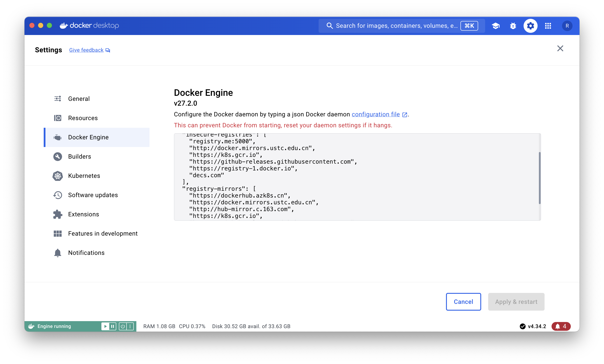

# Dev-On-Docker

## 目录

- [目录](#目录)
- [背景](#背景)
- [Docker安装](#Docker安装)
- [启动环境](#启动环境)
- [开发测试](#开发测试)
- [参考](#参考)

## 背景 

- 当前操作系统无法满足开发环境。例如，Windows 下开发 Linux 环境工程通常需安装虚拟机，或在 WSL 中开发。
- 本地搭建开发环境过于笨重。例如，macOS 进行开发需要安装重量级的 Xcode。
- 开发测试时需要开启多个服务。例如开发 C/S 功能，开启服务端mysql、nginx等，开启客户端发送请求。

## Docker安装

- 方式一：docker 官网下载安装包安装；

  https://www.docker.com

- 方式二：命令行通过包管理器安装（以macOS为例）；

  - 安装包管理器 Homebrew

    - 官网：https://brew.sh

    - 国内安装指南：https://zhuanlan.zhihu.com/p/111014448

      安装脚本 `/bin/zsh -c "$(curl -fsSL https://gitee.com/cunkai/HomebrewCN/raw/master/Homebrew.sh)"`

      卸载脚本 `/bin/zsh -c "$(curl -fsSL https://gitee.com/cunkai/HomebrewCN/raw/master/HomebrewUninstall.sh)"`

    - 注意：需先下载 git，按国内安装方法，安装过程下载会触发系统下载开发者命令行工具，直接确认安装即可，但耗时较长。

  - 安装Docker 

    ```shell
    brew install --cask --appdir=/Applications docker
    ```

## 启动环境

1. Docker desktop 里面修改设置

   - 修改镜像地址

     

     ```json
     {
       "builder": {
         "gc": {
           "defaultKeepStorage": "20GB",
           "enabled": true
         }
       },
       "experimental": false,
       "registry-mirrors": [
         "https://docker.mirrors.ustc.edu.cn",
         "https://registry.docker-cn.com",
         "http://hub-mirror.c.163.com"
       ]
     }
     ```

     【注意】：若在这段json中增加了下述段，后续在 macOS 下无法启动，，需修改为 `"native.cgroupdriver=cgroupfs"`

     ```json
     "exec-opts": [
         "native.cgroupdriver=systemd"
       ]
     ```

2. 启动 docker

3. 拉取镜像

   ```shell
   docker search ubuntu
   ```

4. 查看本地镜像

   ```shell
   docker images
   ```

5. 根据拉取镜像创建容器

   ```shell
   docker pull ubuntu
   ```

6. 运行容器

   ```shell
   docker run --name Ubuntu24.04 -it -p 2022:22 -v /Users/cc/Projects:/home/cc ubuntu bash
   ```

7. 进入容器与退出容器

   执行上一步后，就从macOS默认的 zsh 进入到ubuntu容器的terminal了

   退出到 zsh `exit`

   进入容器 `docker exec -it Ubuntu24.04 /bin/bash`

8. 在容器内搭建自己的开发环境

   ```bash
   > apt-get install -y build-essential cmake git openssh-server gdb pkg-config valgrind systemd-coredump
   ```
   

## 开发测试

- 编写 `HelloWorld.cpp`
- 编译 `g++ HelloWorld.cpp -o HelloWorld`
- 运行 `./HelloWorld`

## 参考

- https://github.com/xiaohejun/cpp_tutorials
- https://blog.csdn.net/m0_73442728/article/details/137644171